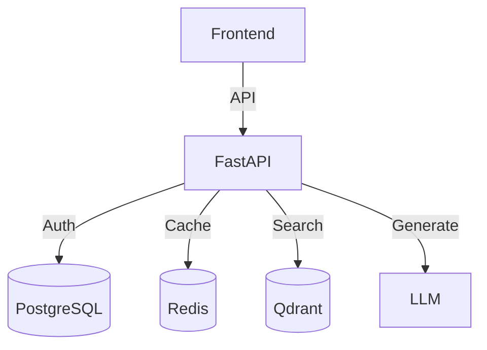
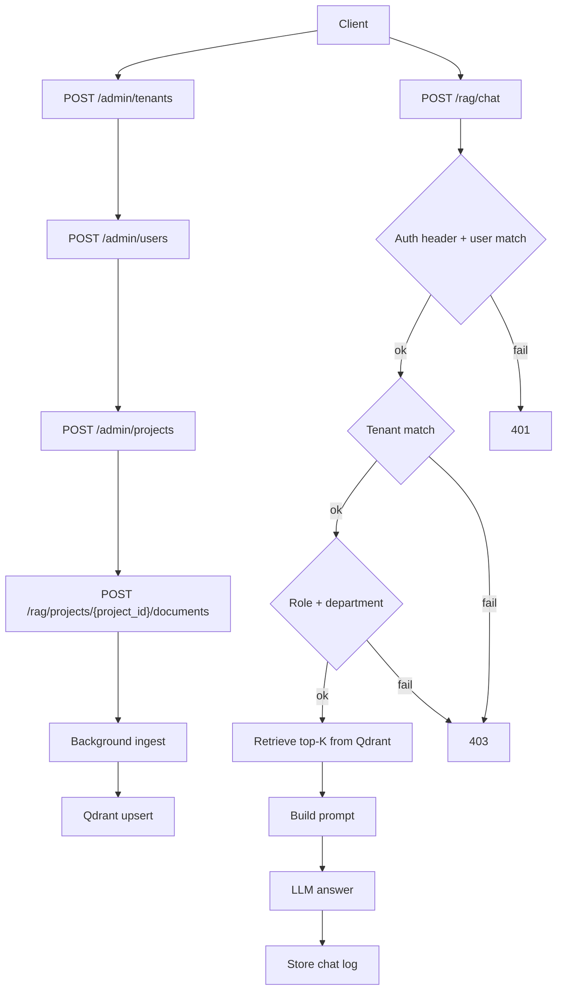
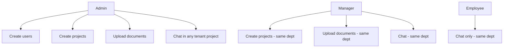

# 🧠 Aura Knowledge Assistant

A powerful, RAG-based internal knowledge assistant for Aura Wellness, capable of answering employee questions based on company policies, project specs, and architectural documents.

---

## 🧐 Problem Framing (Section A1)

### Who is the user?
The primary users are **Employees** (HR, Engineering, Marketing) who spend 20%+ of their time searching for internal information scattered across Google Drive, Slack, and Wikis.

### What decision are they trying to make?
"Can I work from home tomorrow?", "What is the API endpoint for User Profile?", "Do we have a budget approved for Q4 marketing?". They need **immediate, fact-based answers** to proceed with their daily tasks without waiting for a ticket response.

### Why is a normal rule-based system insufficient?
*   **Unstructured Data:** Policies and specs are free-text (PDFs, Markdown), not structured database rows. Regex or Keyword search fails on semantic queries (e.g., searching "WFH" might miss a document titled "Remote Work").
*   **Synthesis Required:** An answer often requires combining facts from multiple documents (e.g., Project Policy + Team Budget). Rule-based systems cannot synthesize.

---

## 🚀 Features & Architecture

*   **RAG:** Chat with documents using `gpt-4o-mini`.
*   **RBAC:** Granular permissions (Admin/Manager/Employee) enforcing Tenant Isolation.
*   **Multi-Tenancy:** Hard separation of data (TenantID enforcement).
*   **Vector Search:** **Qdrant** for semantic context.
*   **Cache:** **Redis** for caching RAG responses to reduce latency and cost.

### System Diagram


---

## 🧭 Approach

1. **Model the domain first:** Tenants, users, projects, documents, and chat logs are explicit tables to make RBAC and tenant isolation enforceable at the database layer.
2. **Enforce access at the API boundary:** Every mutating or RAG endpoint checks tenant + role constraints before touching data.
3. **Keep RAG minimal but correct:** Store raw document text in Postgres, embed chunks to Qdrant, retrieve top‑K, then answer with strict “context only” prompting.
4. **Operational simplicity:** Docker Compose for local dev; no external infra beyond OpenAI.

---

## 📐 System Architecture (A2)

High‑level components:

*   **API layer:** FastAPI (`src/backend/app/main.py`) exposes `/api/v1/admin/*` and `/api/v1/rag/*`.
*   **Prompt layer:** `ChatPromptTemplate` in `src/backend/app/api/v1/endpoints/rag.py`.
*   **LLM usage:** `ChatOpenAI` (answers) + `OpenAIEmbeddings` (vectorization).
*   **PostgreSQL:** source‑of‑record for tenants, users, projects, documents, chat logs.
*   **Vector DB (Qdrant):** per‑tenant + per‑project collections for semantic search.
*   **Redis:** caching retrieval results by `(tenant, project, query)` to control cost.

---

## 🔄 Flow & Conditions (Detailed)

Core flow (happy path):

1. **Create tenant** via `/admin/tenants`.
2. **Create admin user** via `/admin/users` (first admin can be created without `X-User-Id`).
3. **Create project** via `/admin/projects` (requires admin or manager in same tenant).
4. **Upload document** via `/rag/projects/{project_id}/documents` (admin/manager only).
5. **RAG ingestion** runs in background: chunk → embed → upsert to Qdrant.
6. **Chat** via `/rag/chat`: retrieve top‑K chunks → prompt → LLM → log chat.

Access conditions (enforced by API):

*   **Tenant isolation:** `current_user.tenant_id` must match `project.tenant_id`.
*   **Role — Admin:** can create projects/users and manage any project in tenant.
*   **Role — Manager:** can create/manage projects only in their department.
*   **Role — Employee:** read‑only chat within their department.
*   **Chat request:** `user_id` in body must match `X-User-Id` header.

Mermaid flow diagram:



Mermaid role permissions (human‑readable):



---

## 🧱 Data Model (A3)

Minimal schemas (Postgres):

*   **Tenant:** `id`, `name`, `created_at`
*   **User:** `id`, `tenant_id`, `email`, `role`, `department`, `created_at`
*   **Project:** `id`, `tenant_id`, `name`, `department`, `created_at`
*   **Document:** `id`, `project_id`, `title`, `content`, `created_at`
*   **AI Request / Result (ChatLog):** `user_id`, `project_id`, `question`, `answer`, `sources`, `created_at`

Tenant enforcement:

*   **DB:** `tenant_id` is a foreign key on users/projects; projects own documents.
*   **API:** endpoints validate `current_user.tenant_id == project.tenant_id` before read/write.
*   **Vector DB:** collections are namespaced per tenant + project; query uses the same namespace.

---

## 🧪 Prompt Design (A4)

**System prompt (excerpt):** see `AI_PROMPTS.md` for the exact prompt used.  
**User prompt:** `{question}` from the API body.  
**Output format:** structured JSON for stable downstream parsing.

Example JSON format (expected by design):

```json
{
  "answer": "Acme allows remote work 2 days a week. [WFH Policy]",
  "sources": ["WFH Policy"]
}
```

Why this structure:

*   **JSON stability:** consistent keys for UI or downstream tools.
*   **Citations:** `sources` enforces explicit attribution.
*   **Safety:** allows strict refusal with `answer` and empty `sources`.

---

## 🧩 RAG Design (B1)

*   **Chunking:** `RecursiveCharacterTextSplitter` with `CHUNK_SIZE=1000`, `CHUNK_OVERLAP=200`.
*   **Embeddings:** `text-embedding-3-small`.
*   **Storage:** Qdrant collections per tenant+project; payload includes `doc_id`, `title`, `content`, `chunk_index`.
*   **Retrieval:** vector search scoped by tenant+project; top‑K results used as context.

---

## 💰 Cost Control Strategy (C1)

*   **Token limits:** chunking + top‑K retrieval bounds context size.
*   **Cache:** Redis caches retrieval results per `(tenant, project, query)` for 1 hour.
*   **Skip LLM when empty:** if no context is retrieved, return “I don’t know” without calling the LLM.

---

## 🧱 Tenant Isolation Strategy (D1)

*   **Prompt:** only injects context retrieved from a tenant‑scoped collection.
*   **Vector search:** collection naming uses `{tenant_id}/{project_id}` to prevent cross‑tenant hits.
*   **API checks:** tenant mismatch returns 403 before retrieval.

---

## 📂 Project Structure

```bash
src/
├── backend/
│   ├── app/
│   │   ├── api/          # Endpoints (Admin, RAG)
│   │   ├── services/     # core logic (RagService, CacheService)
│   │   └── models.py     # SQLAlchemy Models
│   └── seed.py           # Data Seeding
├── infra/                # Init SQL
└── docker-compose.yml
```

---

## 🛠️ Runbook

### Prerequisites
*   Docker + Docker Compose.
*   OpenAI API key.

### One‑command startup
```bash
docker compose up --build
```

### Environment variables
The backend reads `.env` from `src/backend/.env`. A sample is already provided:

```bash
cat src/backend/.env.example
```

```env
OPENAI_API_KEY=sk-proj-...
```

Optional overrides (defaults are set in `app/core/config.py` and `docker-compose.yml`):

```env
DATABASE_URL=postgresql+asyncpg://postgres:postgres@db:5432/knowledge_db
REDIS_URL=redis://redis:6379/0
QDRANT_URL=http://qdrant:6333
```

### Health checks / verify system works
*   API health: `curl -s http://localhost:8000/health`
*   OpenAPI schema: `curl -s http://localhost:8000/api/v1/openapi.json`
*   Swagger UI: open `http://localhost:8000/docs`

### Seed data (optional but recommended)
Run this inside the container to avoid local dependency issues:
```bash
docker-compose exec backend python seed.py
```
*Copy the **User IDs** from the output.*

### Example API calls (end‑to‑end core flow)
```bash
# Base URL
BASE_URL="http://localhost:8000/api/v1"

# 1) Create a tenant
TENANT_ID=$(curl -s -X POST "$BASE_URL/admin/tenants" \
  -H "Content-Type: application/json" \
  -d '{"name":"Acme Corp"}' | python -c "import sys, json; print(json.load(sys.stdin)['id'])")

# 2) Create an admin user (no X-User-Id header for first admin)
ADMIN_ID=$(curl -s -X POST "$BASE_URL/admin/users" \
  -H "Content-Type: application/json" \
  -d "{\"tenant_id\":\"$TENANT_ID\",\"email\":\"admin@acme.com\",\"full_name\":\"Acme Admin\",\"role\":\"admin\",\"department\":\"IT\"}" \
  | python -c "import sys, json; print(json.load(sys.stdin)['id'])")

# 3) Create a project (admin-only)
PROJECT_ID=$(curl -s -X POST "$BASE_URL/admin/projects" \
  -H "Content-Type: application/json" \
  -H "X-User-Id: $ADMIN_ID" \
  -d "{\"tenant_id\":\"$TENANT_ID\",\"name\":\"Acme HR Policies\",\"department\":\"HR\"}" \
  | python -c "import sys, json; print(json.load(sys.stdin)['id'])")

# 4) Upload a document (admin or manager)
curl -s -X POST "$BASE_URL/rag/projects/$PROJECT_ID/documents" \
  -H "Content-Type: application/json" \
  -H "X-User-Id: $ADMIN_ID" \
  -d '{"title":"WFH Policy","content":"Acme allows remote work 2 days a week."}'

# 5) Ask a question (user_id must match X-User-Id)
curl -s -X POST "$BASE_URL/rag/chat" \
  -H "Content-Type: application/json" \
  -H "X-User-Id: $ADMIN_ID" \
  -d "{\"user_id\":\"$ADMIN_ID\",\"project_id\":\"$PROJECT_ID\",\"question\":\"How many WFH days are allowed?\"}"
```

### Full system test run (end‑to‑end)
```bash
# 1) Start services
docker compose up --build -d

# 2) Confirm health
curl -s http://localhost:8000/health

# 3) Seed sample data (optional)
docker-compose exec backend python seed.py

# 4) Run end-to-end test script (creates tenant/user/project, uploads doc, asks question)
bash scripts/e2e.sh
```

---

## ⚖️ Assumptions & Trade-offs

### Assumptions
*   **Trust Model:** We assume the `X-User-Id` header is injected by a trusted upstream Gateway (e.g., Kong/Nginx). In a real deployment, this service would validation JWTs, not raw IDs.
*   **Document Size:** We assume documents are reasonably small (<10MB). Large PDFs would need an async queue (Celery) for processing, not background tasks.

### Trade-offs
*   **Accuracy vs. Speed:** We use `gpt-4o-mini` for speed and cost. For complex legal document analysis, `gpt-4` would be better but slower/more expensive.
*   **Qdrant on Disk:** We use Qdrant on disk for simplicity. For production scale (millions of vectors), a distributed cluster would be needed.

---

## ⏳ What I’d improve with more time
*   **Auth hardening:** Replace the `X-User-Id` trust model with JWT validation + key rotation.
*   **Ingestion pipeline:** Add PDF/DOCX parsing + async worker queue with retries and observability.
*   **Deletion parity:** Fully implement vector deletion by `doc_id` with confirmation tests.
*   **Evaluation & monitoring:** Add retrieval/answer quality evals, latency SLOs, and cost budgets.

---

## 🚦 Execution Reality Check (Section E)

### 1. What would you ship in 2 weeks?
*   **Slack Integration:** Employees live in Slack. The first UI shouldn't be a web app, but a `/ask` Slack bot.
*   **File Parser:** Robust support for PDF/Docx ingestion (currently assumes text/markdown).

### 2. What would you explicitly NOT build yet?
*   **Fine-tuning:** RAG is sufficient. Fine-tuning an LLM is overkill, expensive to maintain, and hard to update with new policies.
*   **Complex OCR:** We will skip scanned image PDFs for V1 and focus on digital-native text.

### 3. What risks worry you the most?
*   **Data Leakage:** A bug in the `filter={tenant_id}` logic in Qdrant is the biggest risk. Cross-tenant leakage destroys trust. We mitigate this with unit tests enforcing filters on *every* query.
*   **Cost Spikes:** An infinite loop or a DDoS attack on the chat endpoint could drain the OpenAI credits. Use Redis rate-limiting immediately.

---
